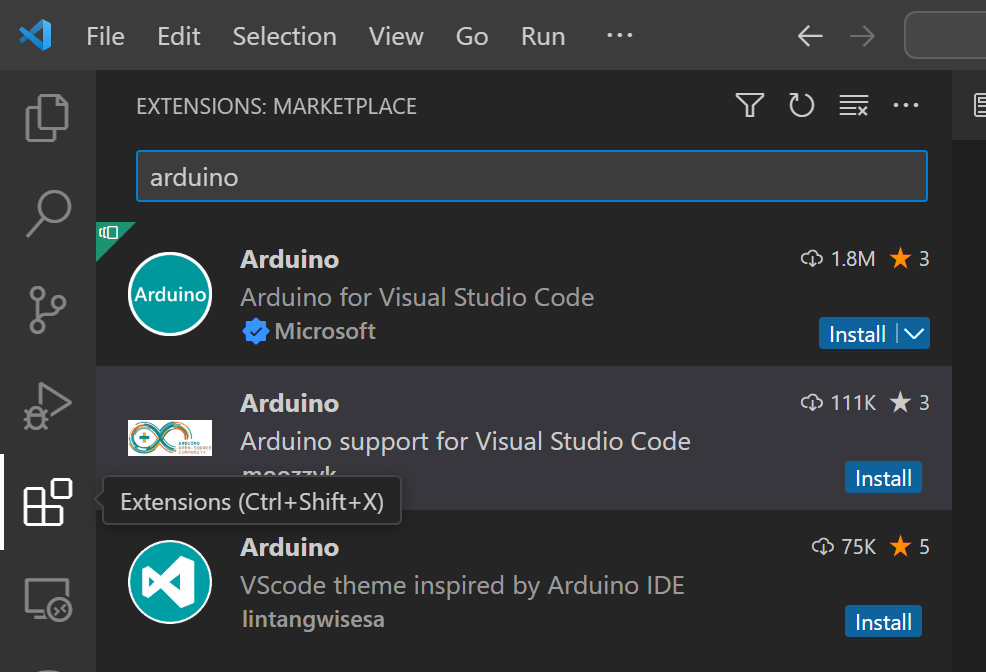
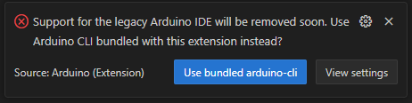
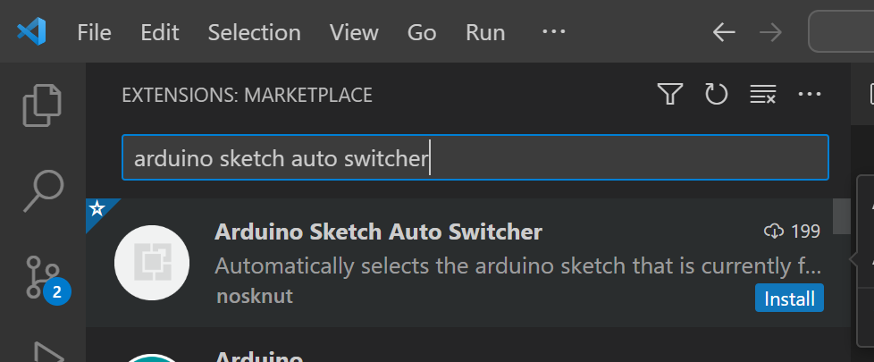
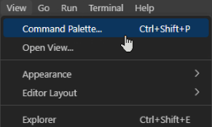

[<-- Tilbake](/README.md#arbeidskrav)

## Installer Arduino Extension

Finn Arduino extension av Microsoft fanen til venstre (de fire klossene) og søk etter arduino. Trykk install knappen for å installere extension.



## Arduino extension feilmelding

Hvis du får dette spørsmålet, trykk Use bundled arduino-cli



## Installer Arduino Sketch Auto Switcher



## Reload Window

Bruk følgende kommando til å starte vscode på nytt for å sikre at alt er i orden

Åpne command palette



Kjør kommandoen

```
Developer: Reload Window
```
