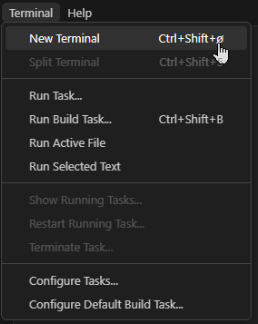

[<-- Tilbake](/README.md#arbeidskrav)

## Lag en GitHub bruker

Lag en [GitHub bruker](https://github.com/signup). Bruk personlig e-post slik at du ikke mister tilgang til kontoen din når du er ferdig med studiene.

Du kan trykke "Skip personalization" nederst på siden når du har opprettet en bruker og du får spørsmål.

## Installer Git

Gå gjennom installasjonsguiden
[[Windows](git/windows/README.md)] [[Mac](https://git-scm.com/downloads)]

Åpne vscode
Åpne en terminal. Legg merke til hurtigtasten. Den er nyttig!



Kjør disse to kommandoene i terminalen som dukket opp nederst på skjermen.

```
git config --global user.name "ditt github brukernavn"
```

```
git config --global user.email "din github epost"
```
