[<-- Tilbake](../../README.md#installer-git)

## Installer Git

Last ned [Git](https://git-scm.com/downloads)

Gjennomfør installasjonen med nøyaktig samme innstillingene som vist i bildene under.

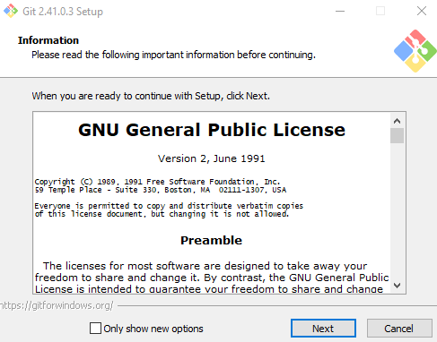
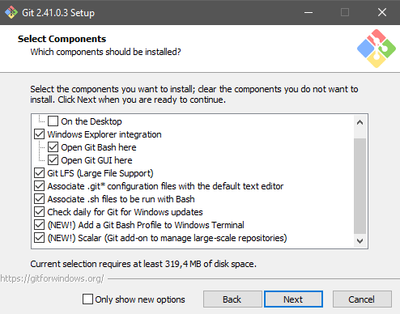
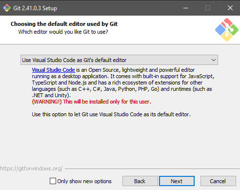
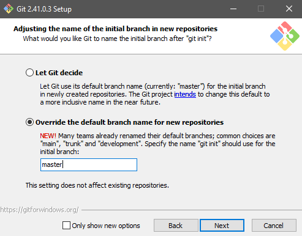
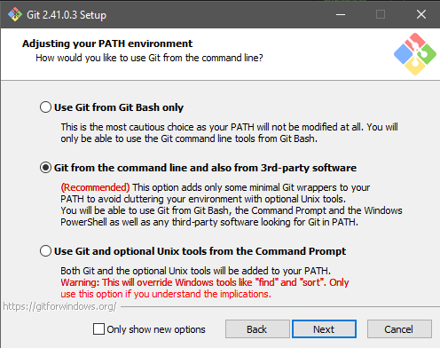
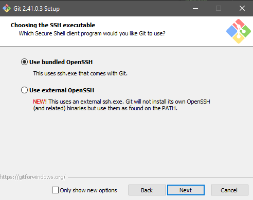
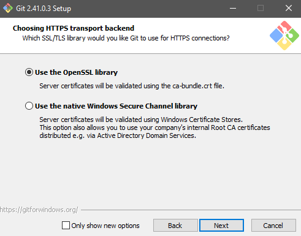

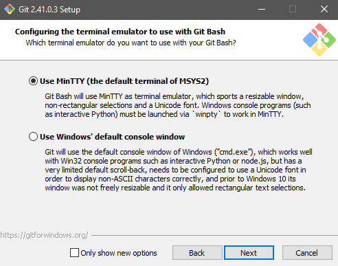
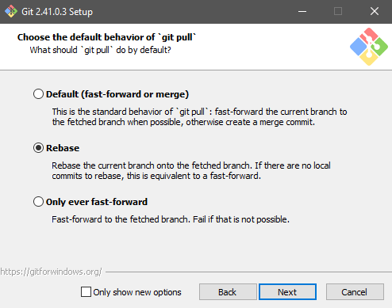
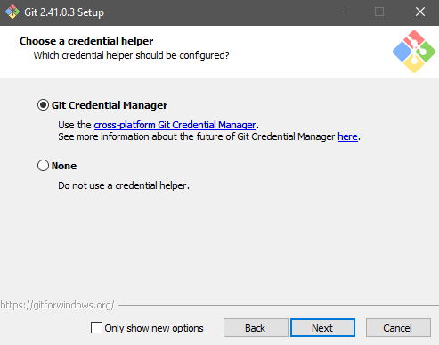
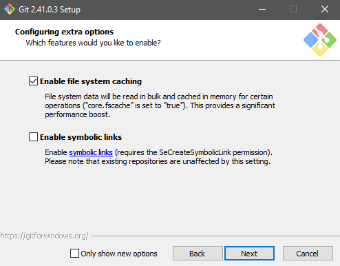
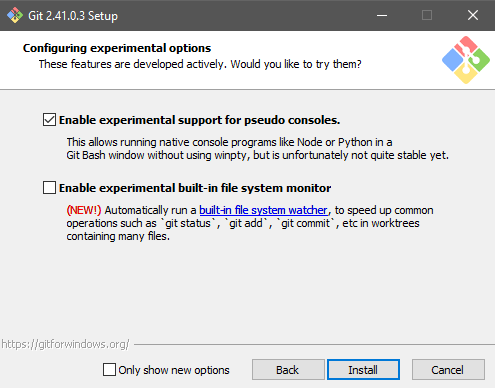

Når du er ferdig, gå [tilbake](../../README.md#installer-git) for å fortsette installasjonen.
