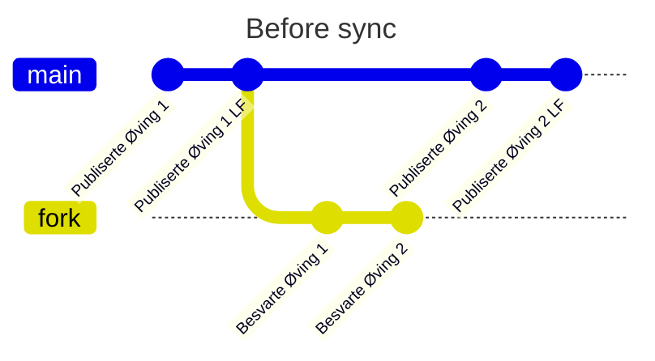
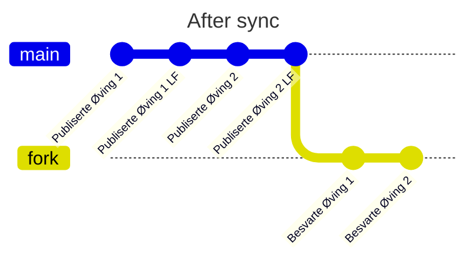

[<- Tilbake](/README.md#arbeidskrav)

# Sync Fork

Grafen under viser forskjellen mellom main repo og fork før en synkronisering har skjedd. Her deler main og fork felles historikk til og med "Publiserte Øving 1 LF". Deretter har main fått to nye commits, "Publiserte Øving 2" og "Publiserte Øving 2 LF". Forken har også fått to nye commits, "Besvarte Øving 1" og "Besvarte Øving 2". Linjen som går mellom main og fork representerer punktet hvor fork brancher fra main, og får sin egen uavhengige historikk. Branching er som å ta en kopi av en fil, og deretter legge til et nytt avsnitt på slutten av begge.

For å slå sammen endringene gjør vi en "git rebase" eller "fast-forward", som vil si at vi resetter fork slik at den er lik main. Deretter tar vi fork sine unike commits og legger de til på slutten av main sin historikk. Dette er det samme som å erstatte kopien med den oppdaterte originale filen, og deretter kopiere inn det nye avsnittet fra kopien.

GitHub har for det meste automatisert denne prosessen for oss. Når en endring pushes til et repo, vil eventuelle forks få en slik melding i GitHub.

Trykk på Sync Fork og Update branch for å importere endringene.

