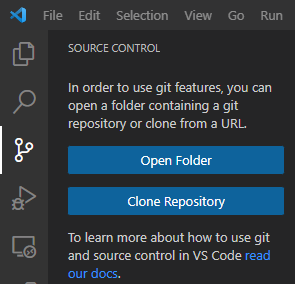
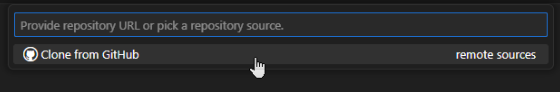
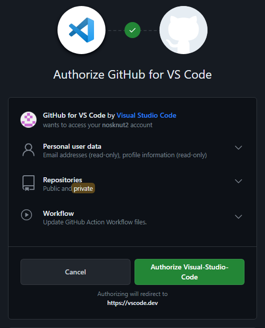
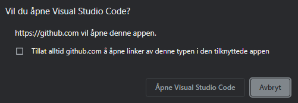
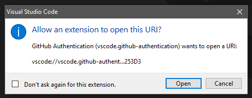
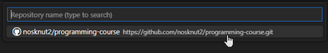
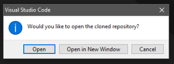
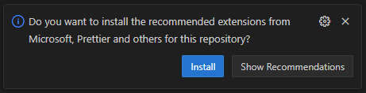
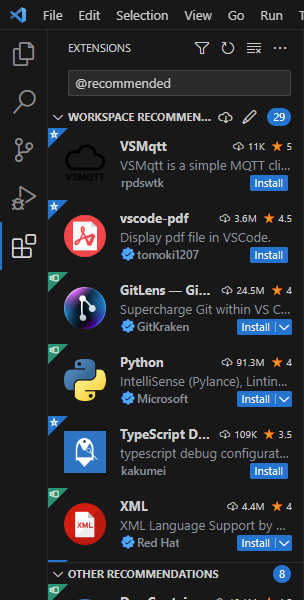

[<-- Tilbake](/README.md#arbeidskrav)

## Logg inn med GitHub bruker i VSCode

Naviger til Source Control og trykk Clone Repository

Velg Clone from GitHub

Du blir nå videreført til nettleseren. Autoriser VSCode til å logge inn på GitHub brukeren din.

Trykk Åpne Visual Studio Code

Trykk Open

Du er nå innlogget med GitHub brukeren din på VSCode

## Clone repository

Velg ditt nye repository som du forket tidligere

Når cloningen er ferdig, trykk open

## Installer recommended extensions

Vi har laget en egen liste med extensions dere kommer til å trenge i løp av året. Trykk Install

Scroll gjennom WORKSPACE RECOMMENDED og trykk Install på alle.

Gå videre til neste trinn når alle er installerte (den blå knappen install/installing) forsvinner.

