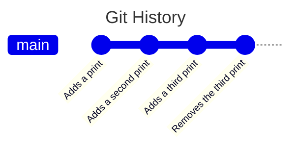
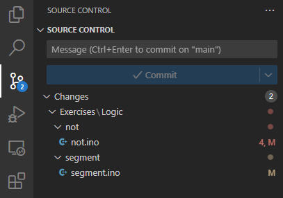
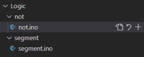
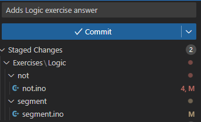
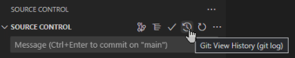
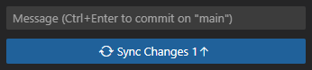
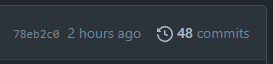

[<- Tilbake](/README.md#arbeidskrav)

# Commit

Git er basert på commits, som består av filendringer. Et git repository består av mange commits i en bestemt rekkefølge. Under er et eksempel av hvordan en slik historikk kan se ut.



### Diff for hver enkelt commit

Forskjellene mellom to commits kalles en diff. Under er diffen for hver enkelt commit i eksempelet over.

### Adds a print

```diff
+ print("Hello World!")
```

### Adds a second print

```diff
print("Hello World!")
+ print("Hello World 2!")
```

### Adds a third print

```diff
print("Hello World!")
print("Hello World 2!")
+ print("Hello World 3!")
```

### Removes the third print

```diff
print("Hello World!")
print("Hello World 2!")
- print("Hello World 3!")
```

## Summen av alle commits

```diff
print("Hello World!")
print("Hello World 2!")
```

## Lage et commit

Når du har lagt til eller endret filer i et git clonet repo, kan du se hvilke filer du har endret i Source Control fanen. Trykk på en fil i denne fanen for å se hva du har endret.



Hvis du trykker på eller holder musen over en av filene , får du opp disse knappene. Pilen fjerner endringene, og pluss knappen vil flytte endringene fra "Changes" til "Staged Changes". Kun endringer i "Staged Changes" vil bli med i et commit.



Når du har lagt til endringene, skriv en beskrivelse av hva du har gjort i "Message" feltet. Når du er ferdig, trykk på "Commit" knappen.



## Inspiser git historikk

Nå er endringene dine lagret i et commit i ditt lokale git repo. Trykk på historikk knappen for å se commit historikken din.



## Git Push

Trykk på Sync Changes for å pushe endringene dine til GitHub.



Gå til forken din i GitHub og se endringene i commit historikken.

## Åpne repo i GitHub

Åpne command palette


Kjør kommandoen

```
Open In Github: Project
```

## Inspiser historikk i GitHub

I github kan du se commit historikken ved å trykke på commits telleren.


